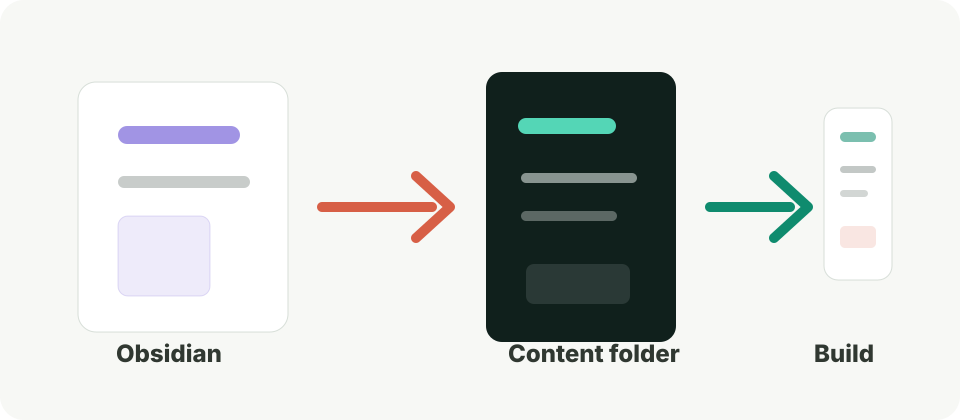

## 截图基准

Malus 的模板截图统一使用 PC 桌面页面和浅色主题。这样 README、文章说明、封面图和后续发布页会保持一致，不会因为设备、深浅色或缩放差异显得杂乱。

推荐基准：

```text
设备：PC 桌面页面
主题：浅色主题
宽度：1440px
高度：按页面内容裁切
浏览器缩放：100%
截图格式：PNG
```

如果需要展示响应式能力，可以单独开一个“移动端适配”小节，不和主展示图混在一起。

## 必备截图

模板展示建议固定准备这些截图：

- 首页首屏。
- 文章详情页。
- 文章列表或归档页。
- 项目页。
- 工具页。
- 搜索弹窗。
- 主题配置或 `.env.local` 示例。

这些截图足够说明模板如何进入内容、如何阅读、如何扩展模块。

## 图片目录

文章图片建议和文章放在同一个目录里：

```text
src/content/blog/2026-05-16-malus-screenshot-workflow/
  index.md
  cover.svg
  assets/
    home-light-desktop.png
    post-light-desktop.png
    search-light-desktop.png
```

正文中使用相对路径：

```md

```

这样文章、封面和截图天然属于同一个包，复制、移动、归档都更清楚。



## 命名规范

建议使用描述性文件名：

```text
home-light-desktop.png
post-light-desktop.png
projects-light-desktop.png
tools-light-desktop.png
search-light-desktop.png
```

命名里固定包含页面、主题和设备，后续维护时一眼就能知道图片用途。

## Obsidian 写作设置

如果用 Obsidian 写文章，建议关闭 Wikilinks，并把附件默认保存到当前文章目录下的 `assets`。这样粘贴截图后，Markdown 更容易保持标准写法，也更适合直接交给 Astro 构建。

截图进入文章前，先确认画面里没有私人信息、真实 token、真实评论仓库 ID 或本地路径。
